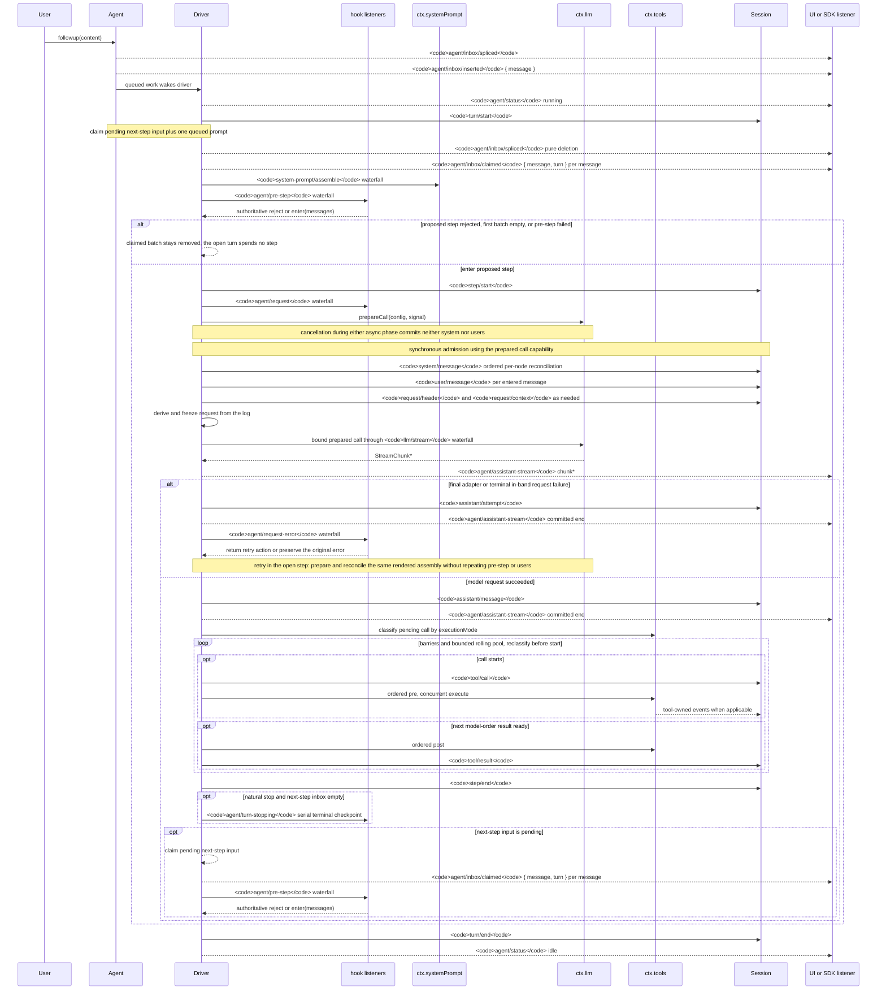

<!-- El archivo fuente en inglés está generado por scripts/gen-doc-graphs.ts; este archivo en español es la contraparte revisada mantenida mediante el emparejamiento bilingüe.
     Al actualizar, ejecutar primero `pnpm run gen-doc-graphs` para actualizar el inglés, después actualizar este archivo y ejecutar `pnpm run verify-translation-pairing --write docs/agent-lifecycle.md` para volver a registrar el emparejamiento. -->

# Ciclo de vida de turnos y pasos del agent

[English](agent-lifecycle.md) | Español

Esta secuencia es el complemento visual de [architecture.md](architecture.es.md#turn-flow). Mantiene los hechos duraderos de reproducción en `session/event` y el control y el estado en vivo en `agent/*`.

El evento `assistant/message` registra cada llamada exitosa al proveedor, incluidas las finalizaciones sin contenido y las de `max-tokens`, e incorpora el flujo compacto exacto con marcas de tiempo. El contenido vacío queda fuera del historial derivado. Un intento fallido, reintentado, cancelado o con error de flujo que llega al settlement sin un surface message registra su flujo como `assistant/attempt`. Los fragmentos en vivo de `agent/assistant-stream` son transitorios; la reproducción lee cualquiera de los dos settlement duraderos, y una pérdida brusca del proceso antes del settlement no deja ningún flujo de intento duradero.

`dsh-compaction-basic` usa `agent/pre-step` para la presión antes de la derivación de la solicitud, y `agent/request-error` solo para el desbordamiento de contexto canónico. Una vez que cualquiera de los dos disparadores se cumple, la poda opcional de resultados de tool se ejecuta antes de la selección del resumen. La recuperación ocurre dentro del paso abierto y reintenta solo cuando la poda o la generación de resúmenes hace avanzar la generación de surface replacement; de lo contrario, prevalece el error de solicitud original. Cada reintento prepara su llamada y reconcilia el ensamblado renderizado retenido antes de la derivación de la solicitud, sin repetir el ensamblado, el pre-step ni la admisión de usuarios.

La decisión devuelta por `agent/pre-step` es autoritativa; los listeners que envuelven `next()` conservan los mensajes posteriores y `startsRequestSeries` salvo que la sustitución sea intencional. El steering (guía a mitad de camino) y el contexto inyectado pasan por el mismo waterfall (eventos en cascada) después de que una operación de reclamación posterior tome su lote de entrada de paso siguiente.

Los usuarios del SDK que necesitan datos de transcript (transcripción) reproducibles deben consumir `session/event`; `agent/*` es la API de coordinación en vivo para la cola y el estado, la interceptación de prompts, la construcción de solicitudes, el steering, la continuación y los errores.

Modo de mantenimiento: secuencia Mermaid curada; las firmas exactas de los eventos residen en el catálogo de Cordis generado.
