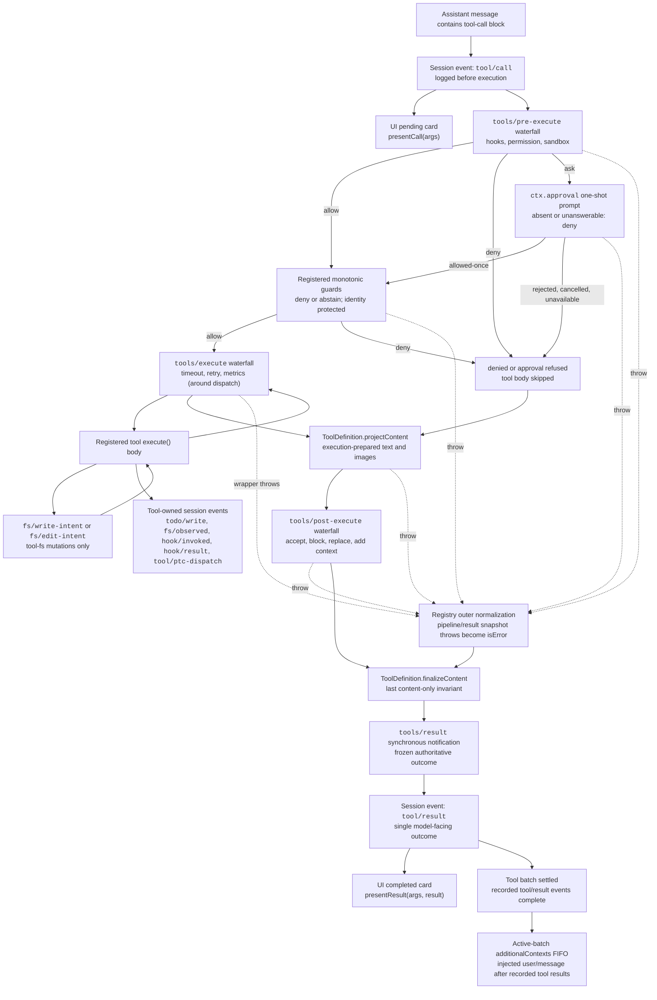

<!-- El código fuente en inglés lo genera scripts/gen-doc-graphs.ts; este archivo en español es la contraparte revisada mantenida mediante el emparejamiento bilingüe.
     Para actualizarlo, ejecutar primero `pnpm run gen-doc-graphs` para actualizar el inglés, después actualizar este archivo y ejecutar `pnpm run verify-translation-pairing --write docs/tool-execution-pipeline.md` para volver a registrar el par. -->

# Pipeline de ejecución de tools

[English](tool-execution-pipeline.md) | Español

Este grafo muestra dónde se ejecutan la política, los hooks, el sandbox, las guardas del sistema de archivos, la reescritura de resultados, la observación del resultado final y el renderizado de UI sin cambiar el bucle. El waterfall (eventos en cascada) `tools/pre-execute` se ejecuta primero, las guardas monótonas a continuación, y después los waterfalls `tools/execute` y `tools/post-execute`; los tres waterfalls pueden transformar una llamada. El `projectContent`, propiedad de la definición, instala el contenido preparado antes de post-execute; `finalizeContent` y `tools/result` se ejecutan después.

Las comprobaciones de lectura antes de edición del sistema de archivos permanecen bajo `tool-fs` en los eventos `fs/*`. Los waterfalls genéricos pre/post alojan hooks y la política de aprobación; `ctx.approval` resuelve las preguntas antes de las guardas monótonas, y la política del propietario que no debe reordenarse permanece como guarda registrada. Las preocupaciones alrededor del despacho, como los timeouts, envuelven `tools/execute`. El registry toma un snapshot sin pérdidas del resultado candidato y normaliza un fallo de snapshot antes de que el callback `finalizeContent`, con snapshot de la definición visible, aplique su invariante síncrono de solo contenido. `tools/result` observa después el resultado inmutable y de JSON sin pérdidas. Esto permite a los hooks abarcar familias de tools sin acoplar los tools a un único servicio de política. El modo PTC envía tanto el transporte reservado `run_code` como sus subllamadas serializadas a través del pipeline; las subllamadas llevan el token del padre, registran `tool/ptc-dispatch`, devuelven las denegaciones como rechazos del binding y omiten `additionalContexts` para preservar la adyacencia llamada/resultado.

Modo de mantenimiento: flujo Mermaid curado; los schemas exactos de tools y las firmas de eventos viven en los catálogos generados.
